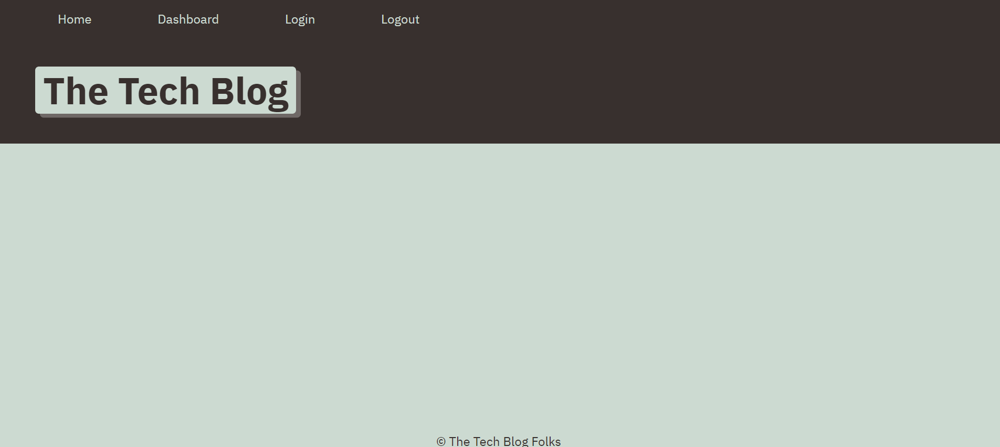
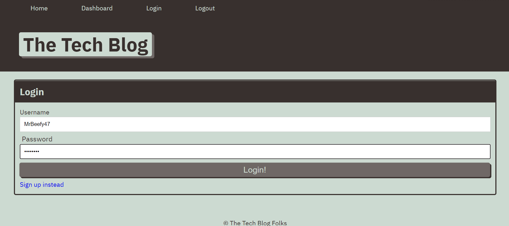
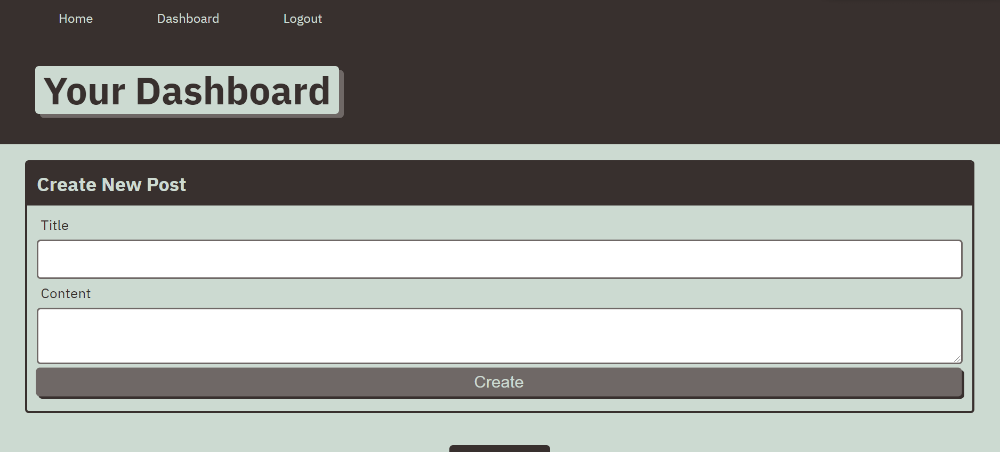
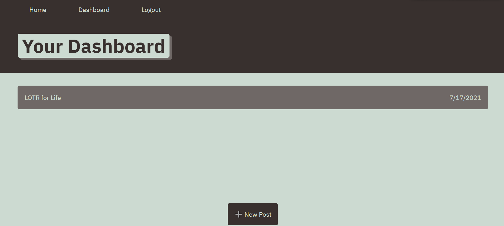

# Technology-blog

# Description

Finished assignment for week 14: Model-View-Controller (MVC): Tech Blog

Name: Technology-blog

Our objective for this assignment was to build a CMS-style blogging website where developers can publish their posts and comment on other users posts as well. The site was built from scratch and follows the MVC paradigm in its architectural structure, using Handlebars.js as the templating language, Sequelize as the ORM, and the express-session npm package for authentication.

The application will allow users to login with a username and password so they can save their posts and then comment on their own or others posts as well.

# Technologies Used

- HTML/CSS/Javascript
- Node.js
- Express.js
- Handlebars.js
- MySQL and the Sequelize ORM for the database.
- Heroku

# Links

Github URL: https://github.com/trevorwiegand92/Technology-Blog

Heroku URL: https://technoblogo.herokuapp.com/

# Acknowledgments

We worked on this assignment as a class during office hours and would like to thank our instructor and TA's for their help with this assignment.

# Screenshots

### Here's a screenshot of the finished homepage.

### Here's a screenshot of the login page.

### Here's a screenshot of the finished new post page.

### Here's a screenshot of the finished dashboard page.

#Screenshots
